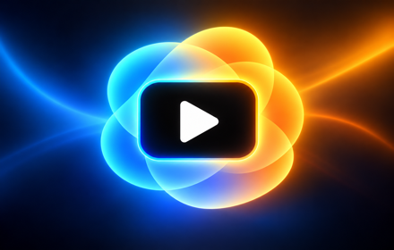
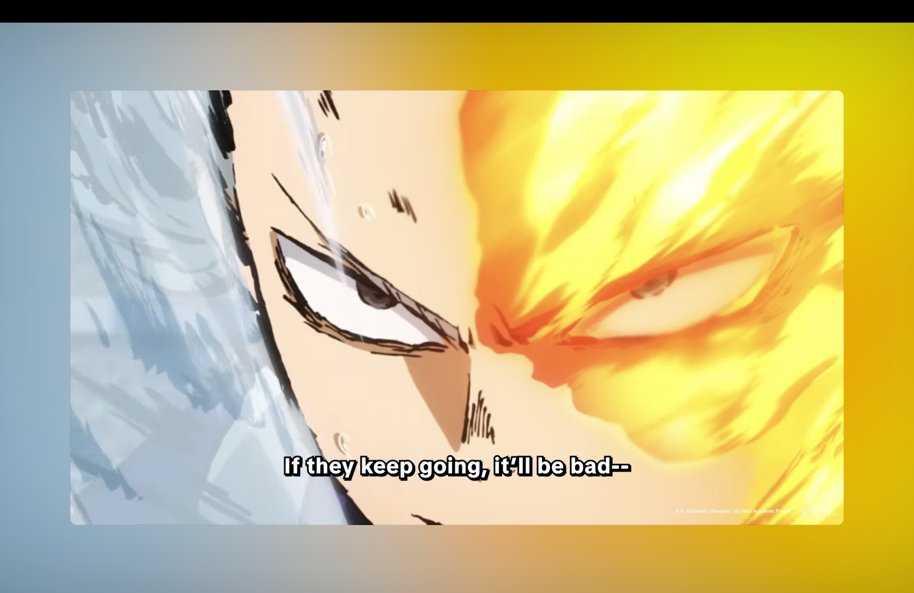
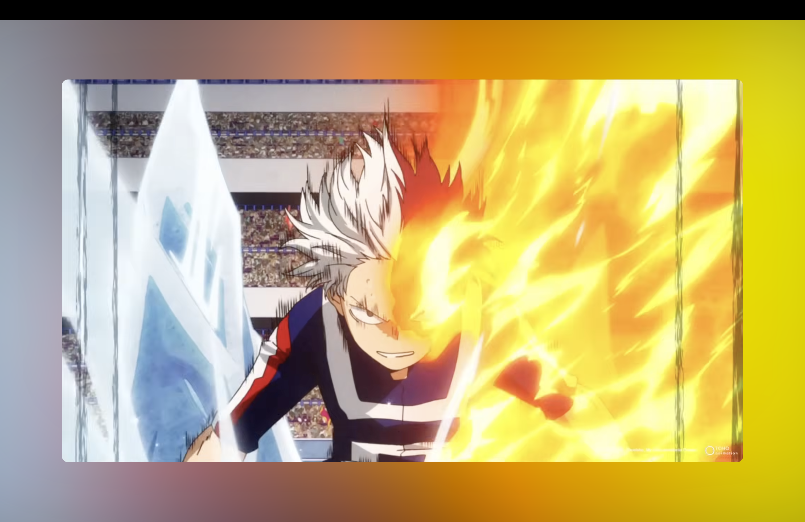

<div align="center">
  

  <h1>Ambient Focus for YouTube™</h1>

  <p>
    A calm, cinematic YouTube layout with a centered player and<br>
    an ambient background generated locally from the current video.
  </p>

  

  <p>
    <a href="#features">Features</a> ·
    <a href="#install-from-source">Install</a> ·
    <a href="#controls">Controls</a> ·
    <a href="#privacy">Privacy</a> ·
    <a href="#development">Development</a>
  </p>
</div>

## Preview

<table>
  <tr>
    <td></td>
    <td></td>
  </tr>
</table>

## Demo video on YouTube

[](https://youtu.be/peXrH_4yxUw)

## Features

- Centers the video and hides the header, recommendations, chat, and content
  below the player.
- Offers blurred-video and sampled-gradient ambient backgrounds.
- Restores YouTube's normal layout instantly when disabled.
- Runs entirely in the current tab with no analytics, accounts, tracking,
  remote code, or external services.
- Uses plain JavaScript and CSS with no build step or runtime dependencies.

## Install from source

1. Download or clone this repository.
2. Open `chrome://extensions` in Chrome.
3. Enable **Developer mode**.
4. Select **Load unpacked**.
5. Choose the repository's `chrome` directory.
6. Open a YouTube video.

Ambient Focus activates automatically on standard YouTube watch pages.

## Controls

| Control                | Action                              |
| ---------------------- | ----------------------------------- |
| **GLOW**               | Turn Ambient Focus on or off        |
| **BLUR / GRAD**        | Switch the ambient background style |
| **Escape**             | Return to YouTube's normal layout   |
| Extension toolbar icon | Turn Ambient Focus on or off        |

## Privacy

Video frames are reduced to a low-resolution canvas inside the open tab and
used only to draw the ambient background. Nothing is stored or transmitted.
See the full [privacy policy](PRIVACY.md).

## Development

The uploadable extension is the contents of `chrome`, with `manifest.json` at
the root. To create a release archive:

```sh
mkdir -p dist
cd chrome
zip -r ../dist/ambient-focus-for-youtube-0.1.0.zip . -x '*.DS_Store'
```

Run the live browser check with a compatible ChromeDriver:

```sh
python3 tests/browser_check.py chrome --live --extension chrome
```

The check opens a separate automated browser session and writes ignored output
to `test-results`.

## Contributing

Bug reports and focused pull requests are welcome. When changing layout or
rendering behavior, describe the YouTube page state and run the browser check.

Chrome Web Store copy and submission notes are available in
[STORE_LISTING.md](STORE_LISTING.md).

## License

Released under the [MIT License](LICENSE).

YouTube is a trademark of Google LLC. This project is independent and is not
affiliated with, endorsed by, or sponsored by Google LLC.
